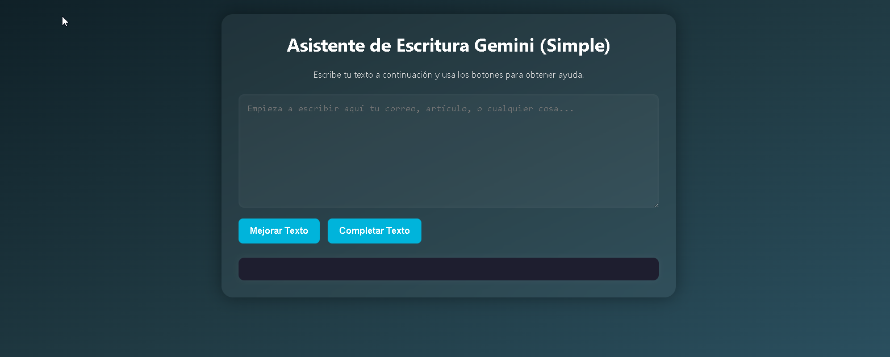

# ✍️ Asistente de Escritura Inteligente con Gemini (Versión Simple)

[](http://unlicense.org/)

Este proyecto es una **versión inicial y simplificada** de un Asistente de Escritura inteligente.

Aprovecha el poder de la API de **Google Gemini** para ofrecerte sugerencias de estilo, corrección gramatical y generación de texto, todo ello accesible a través de una interfaz web intuitiva.

<br>

✨ **Características (Versión Simple):**

* 📝 **Editor de Texto Básico:** Un área de texto (textarea) intuitiva para que puedas escribir y editar tu contenido fácilmente.
* ✨ **Mejora de Texto:**
    * Envía tu texto a Gemini para recibir **correcciones gramaticales**, **sugerencias de estilo**, y mejoras para una mayor **claridad y concisión**.
* 💡 **Completado de Texto:** Permite que Gemini genere continuaciones lógicas para tus oraciones o párrafos, una herramienta ideal para **desbloquear tu creatividad** y superar el bloqueo del escritor.
* 🌐 **Interfaz Simple:** Una aplicación web **ligera y fácil de usar**, construida con las tecnologías web fundamentales: **HTML**, **CSS** y **JavaScript**.

<br>

## ⚙️ Arquitectura del Sistema (Conceptual)

Aunque esta es una versión simple, la arquitectura conceptual detrás de un sistema de asistente de escritura.

```

```

🚀 ¿Cómo Empezar?
Sigue estos sencillos pasos para poner en marcha tu asistente de escritura:

Crea el directorio del proyecto:

```
mkdir AsistenteEscrituraGemini
cd AsistenteEscrituraGemini

```

Crea y activa un entorno virtual de Python:
```
python3 -m venv .venv
source .venv/bin/activate  # En Linux/macOS
# .venv\Scripts\activate   # En Windows
```

Instala las dependencias: Asegúrate de tener un archivo requirements.txt con las siguientes dependencias y luego instálalas:
```
flask
flask-cors
python-dotenv
google-generativeai
```

Ejecuta el siguiente comando para instalar:
```
pip install -r requirements.txt
```

#
Obtén tu Clave de API de Gemini:

Ve a Google AI Studio y obtén una clave de API de Gemini.
Clona el repositorio (o crea los archivos manualmente):
Si prefieres clonar el repositorio con el código base:
```
git clone [https://github.com/HyEd-IA/llm-rodrigo2311037.git](https://github.com/HyEd-IA/llm-rodrigo2311037.git) .
```

Si optas por crear los archivos manualmente, asegúrate de tener al menos un archivo app.py para el backend y los archivos HTML, CSS y JavaScript para el frontend.

Configura tu Clave de API:

Crea un archivo .env en el mismo directorio que tu archivo app.py.
Añade tu clave de API de Gemini al archivo .env:
```
GEMINI_API_KEY=TU_API_KEY_DE_GEMINI_AQUI
```
Reemplaza TU_API_KEY_DE_GEMINI_AQUI con tu clave real.

#
Ejecuta la aplicación backend:
Abre tu terminal (asegurándote de que el entorno virtual esté activado) y ejecuta el backend de Flask:
```
python app.py
```
Deberías ver un mensaje indicando que el servidor Flask se está ejecutando (generalmente en http://127.0.0.1:5000/).

Abre la interfaz web: Abre tu navegador web y navega al archivo index.html (o el nombre del archivo principal de tu frontend) que se encuentra en el directorio del proyecto


&lt;br>

🛠️ Requisitos del Sistema
Asegúrate de tener los siguientes requisitos instalados en tu sistema:

Python: Versión 3.x
pip: El gestor de paquetes de Python (generalmente se instala con Python).
Entorno de desarrollo: Recomendado un sistema operativo basado en Unix (como Ubuntu con WSL en Windows o macOS) para una experiencia de desarrollo más fluida, aunque puede ser posible ejecutarlo en otros entornos con las configuraciones adecuadas.
&lt;br>

🚀 ¡Listo!
Con estos pasos, deberías tener todo lo necesario para ejecutar tu Asistente de Escritura Inteligente impulsado por Gemini. ¡Empieza a escribir y experimenta con las funciones de mejora y completado de texto!

Nota: Esta es una versión simple y puede tener limitaciones. Las futuras versiones podrían incluir más funcionalidades y una interfaz de usuario más elaborada.


